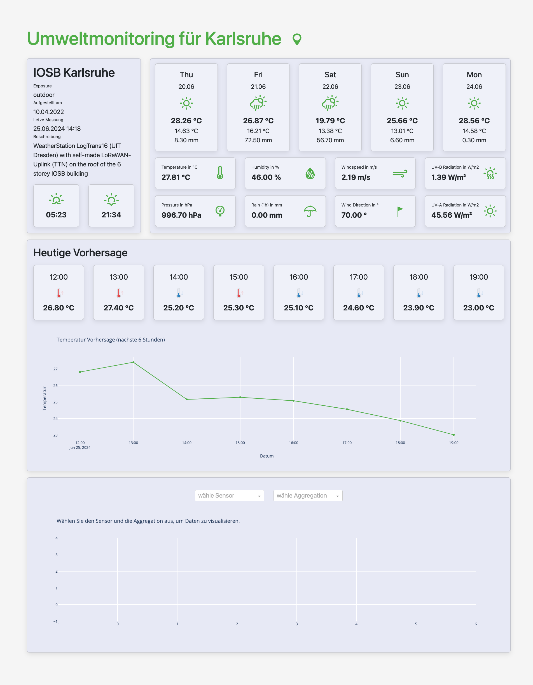

# README

## Umweltmonitoring Dashboard

### Projektbeschreibung
Dieses Projekt wurde entwickelt, um ein Dashboard zur Überwachung und Vorhersage von Umweltdaten bereitzustellen. Ziel ist es, Daten, die von einer senseBox gesammelt werden, in Echtzeit zu visualisieren und mithilfe von maschinellem Lernen Vorhersagen für bestimmte Messvariablen zu treffen. Das Dashboard soll dabei helfen, Umweltbedingungen zu überwachen, historische Trends zu analysieren und zukünftige Entwicklungen vorherzusagen. Die Anwendung wurde mit den folgenden Hauptkomponenten entwickelt:
- **Datenquelle:** openSenseMap
- **Datenhaltung:** PostgreSQL
- **Darstellung:** Plotly & Dash
- **Vorhersage:** NeuralProphet

### Anforderungen und Funktionen
Die Anwendung erfüllt die folgenden Anforderungen:
1. **Echtzeitfähigkeit:** Die Anwendung fragt kontinuierlich neue Daten von der openSenseMap API ab und verarbeitet sie.
2. **Interne Datenhaltung:** Die Anwendung speichert die abgerufenen Daten in einer PostgreSQL-Datenbank und verwendet diese Daten, um Vorhersagen zu treffen und historische Daten anzuzeigen.
3. **Benutzerinformationen:** Das Dashboard bietet eine Vielzahl von Informationen, einschließlich:
   - Kartendarstellung der senseBox-Standorte.
   - Zeitreihenanalyse der gesammelten Daten.
   - Schlüsselkennzahlen (KPIs) und Aggregationen.
   - Visuelle Darstellung der Vorhersagen.

### Screenshot
